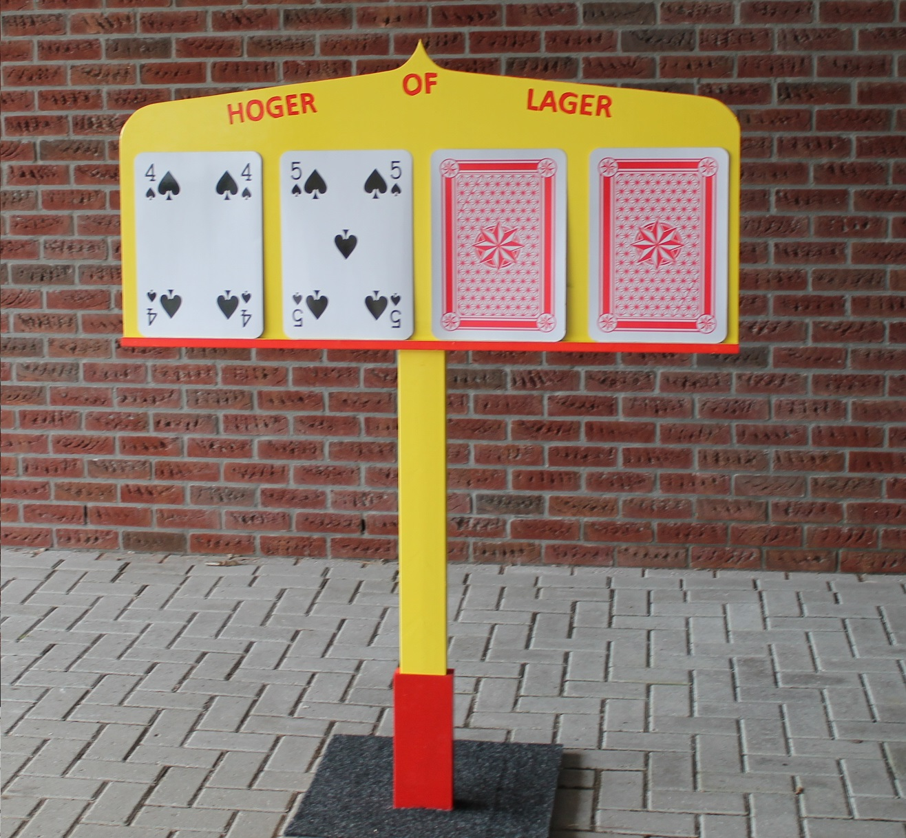
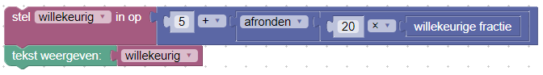
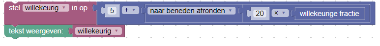
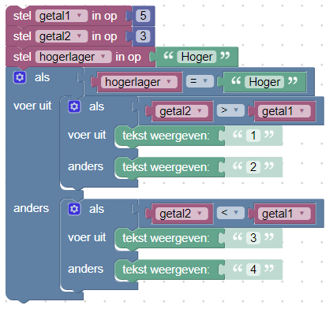
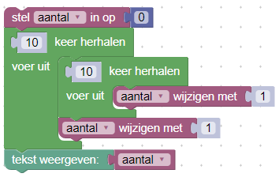

# Oefening 2: Blokken slaat terug

## Doel

Gebruik van een grafische programmeertaal Blokken om meer geavanceerde algoritmen te implementeren.

## Opdracht

Maak een programma om het spel "hoger / lager" te spelen. In dit spel wordt een kaart weergegeven en moet de speler raden of de volgende kaart hoger of lager zal zijn. Indien de speler correct raadt, herhaalt zich dezelfde vraag, maar dan met de nieuwe kaart. Indien de speler verkeerd was, dan houdt het spel op. Het is de bedoeling dat een speler zo lang mogelijk correct blijft raden.

### Genereren van een willekeurig getal

1. Om in Blokken een willekeurig getal te genereren, gebruik de blok *willekeurige fractie*. Deze blok geeft een willekeurige fractie tussen 0.0 (inclusief) en 1.0 (exclusief). Om hiervan een geheel getal te maken, rond het resultaat af. Dit levert dan ofwel 1 ofwel 0 op. Om het bereik van het willekeurige getal aan te passen vermenigvuldig je de willekeurige fractie met de waarde van (bovengrens - ondergrens) van het bereik voordat de waarde afgerond wordt. Een ondergrens wordt ingesteld door na het afronden de waarde van de ondergrens bij het willekeurige getal op te tellen.

 

 Figuur 1: Genereert een willekeurig geheel getal tussen 5 en 25 inclusief.

2. Om een waarde van een kaart voor te stellen, genereer een getal tussen 1 en 13, beiden inclusief. De boer stemt dan overeen met 11, de dame met 12 en de koning met 13.

::: tip Vraag

Hoeveel getallen na de komma worden door een willekeurige fractie gegenereerd?

Figuur 2: codevoorbeeld vraag 2.
:::
::: tip Vraag

Indien naar beneden wordt afgerond, wat is dan het grootste getal dat gegenereerd kan worden door de code in figuur 2?
:::
### Genereer twee verschillende getallen

1. Genereer een tweede willekeurig getal. Controleer of het tweede getal niet gelijk is aan het eerste. Indien dit het geval zou zijn, probeer dan opnieuw een verschillend willekeurig getal te genereren.
2. Toon de gebruiker het eerste getal.
3. Vraag de gebruiker of het tweede getal groter of kleiner zal zijn dan het eerste.
4. Geef het resultaat terug: "winst" of "verlies". Merk op dat er 4 mogelijke scenario's zijn:

  1. de gebruiker gokt hoger en het tweede getal is hoger
  2. de gebruiker gokt hoger en het tweede getal is lager
  3. de gebruiker gokt lager en het tweede getal is hoger
  4. de gebruiker gokt lager en het tweede getal is lager

  Je zou dit kunnen omschrijven in één **als** blok. Echter is het soms duidelijker om geneste **als** blokken te voorzien. Dit zijn **als** blokken binnen één van de takken van een andere **als** blok.

Figuur 3: codevoorbeeld vraag 3.

::: tip Vraag

Welk getal wordt weergegeven bij de uitvoer van het codevoorbeeld van figuur 3?
:::

### Herhaling

1. Indien de gebruiker correct gokt, herhaalt het spel zich waarbij een nieuw getal gegenereerd wordt en dit vergeleken wordt met het tweede getal.
2. Indien de gebruiker niet correct gokt, dan houdt het spel op met de boodschap hoeveel keer hij juist heeft gegokt.

Figuur 4: codevoorbeeld vraag 4.

::: tip Vraag

Welk getal wordt weergegeven bij de uitvoer van het codevoorbeeld van figuur 4?
:::
### Extra

1. Indien de gebruiker een onverwachte invoer geeft, bvb. "Hallo", dan wordt de gebruiker hiervan verwittigd en krijgt de gebruiker opnieuw de kans om een correcte invoer te geven.
2. Maak gebruik van een lijst van getallen in plaats van apart variabelen voor de getallen. Pas de code aan. Probeer hierbij te vermijden dat een variabele voor het aantal keer dat de gebruiker juist heeft gegokt nodig is.
3. Maak het spelletje Blackjack. Hierbij wordt iedere keer aan de gebruiker gevraagd indien nog een kaart gedraaid moet worden. De waarde van alle kaarten wordt telkens opgeteld. De koning, dame en boer hebben hierbij de waarde 10, een aas heeft ofwel de waarde 1 of 11. Zolang de som van alle kaarten lager is dan 21 kan de gebruiker een kaart bijvragen. De bedoeling is om een zo hoog mogelijke waarde te halen zonder boven de 21 te gaan.
4. Maak een eenvoudige AI voor Blackjack, bvb. zolang de waarde van de gedraaide kaarten lager is dan 17 blijft de AI een kaart bijvragen.

