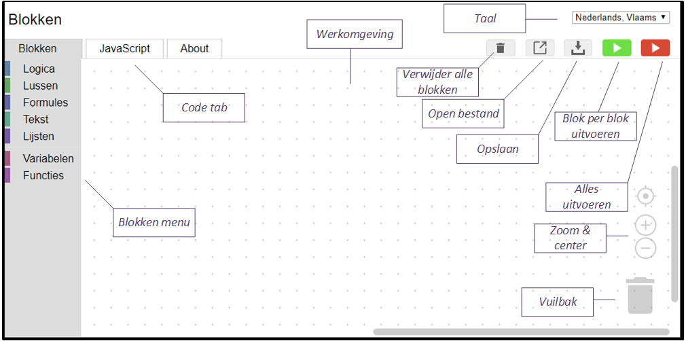
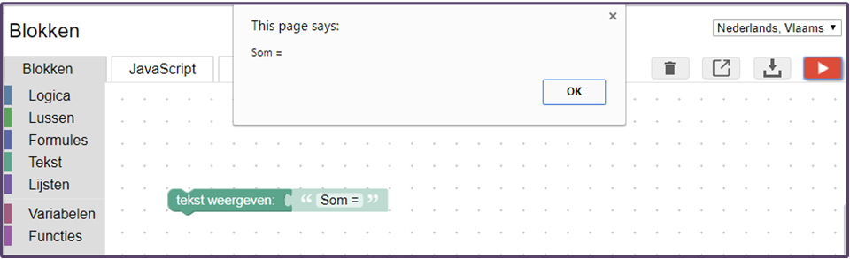
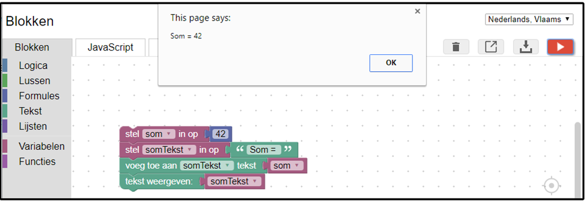
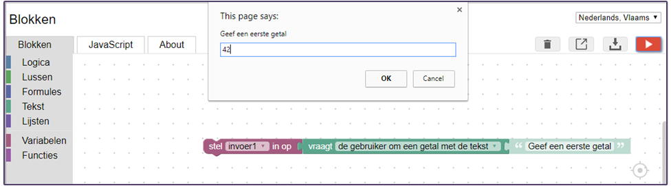
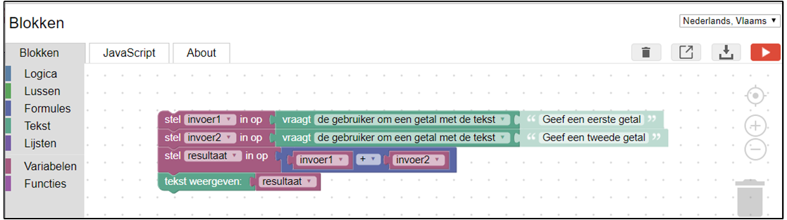
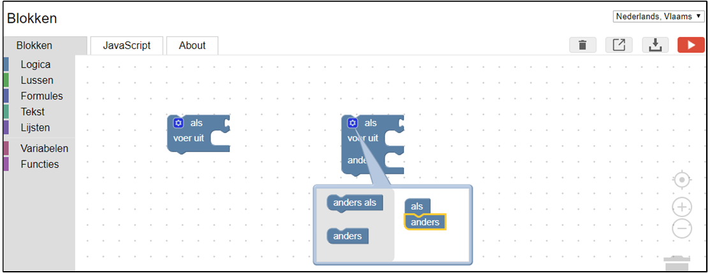
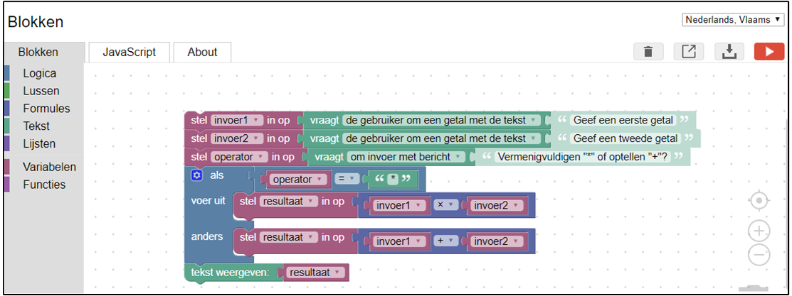
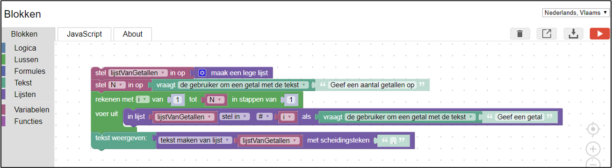

# Oefening 1: Blokken, een nieuwe hoop

## Doel

Gebruik van een grafische programmeertaal om kennis te maken met basisconcepten van algoritmen en gestructureerd programmeren. Dit zijn onder andere variabelen, uitdrukkingen, selectie, herhalingen en lijsten.

## Opdracht

### Openen van Blokken
1. Download het **blokken.zip** bestand van [GitHub](https://github.com/pcordemans/blokken) met de *Blokken* programmeeromgeving. Pak het **.zip** bestand uit: klik in windows verkenner rechts op het **blokken.zip** bestand, **Alles Uitpakken...**  
2. Open het bestand **index.html** met de *Chrome* browser.

  
  Figuur 1: Een lege Blokken programmeeromgeving. In het Blokken menu kan je blokken selecteren en slepen naar de werkomgeving. Deze blokken stellen een programma voor. Dit programma kan je bekijken door op het *JavaScript* tab te klikken. Het programma kan je uitvoeren door op één van de *uitvoeren* knoppen te klikken. Met de groene *blok per blok uitvoeren* knop is het mogelijk om stapsgewijs het programma uit te voeren. Met de rode *alles uitvoeren* knop worden alle blokken onmiddellijk uitgevoerd.   

  Daarnaast vind je knoppen om het huidige programma op te slaan of een programma te openen, alsook de mogelijkheid om alle blokken te verwijderen.

  Rechtsboven vind je de mogelijkheid om een taal in te stellen. Rechtsonder kan je in- of uitzoomen of het huidige programma te centreren. Tenslotte vind je ook een vuilbak waarin je één blok kan slepen om die te verwijderen.

  Tip: sla regelmatig de code op. Eenmaal het venster sluit of een *refresh (F5)* worden alle blokken verwijderd. Indien de code een oneindige lus bevat en de rode uitvoeren knop ingedrukt werd, is het onmogelijk het programma te onderbreken en is het enkel mogelijk het venster te sluiten.

### Tekst weergeven

1. Klik op **Tekst**. Sleep een **tekst weergeven** blok naar de werkomgeving. Verander "abc" naar "Som =".
2. Druk op de uitvoeren knop. Een venster verschijnt waarin de tekst weergegeven wordt.

  
  Figuur 2: Het uitvoeren van de **tekst weergeven** blok zorgt ervoor dat een pop-up venster wordt geopend.

### Variabelen

1. *Maak een variabele:* Klik op **Variabelen**, **Variabele maken...** Vul in het pop-up venster **som**. Tip: Blokken hecht belang aan  hoofdletters en kleine letters. **Som** is niet gelijk aan **som** of **sOm**.
2. *Initialiseer een variabele:* Sleep **stel som in op** naar de werkomgeving. Klik deze blok boven vast in **tekst weergeven**. Klik op **Formules** en sleep **het getal** 0 naar de werkomgeving. Klik deze rechts vast in **stel som in op**. Verander de waarde 0 naar 42.
3. Maak een nieuwe variabele *somTekst* aan. Stel de initiële waarde van *somTekst* in op *"Som = "*, zie stappen 1 en 2.  Tip: Een blok om een stuk tekst in te vullen, vind je onder **Tekst**.
4. *Concateneren van tekst* betekent het samenvoegen van verschillende variabelen waaronder een tekst variabele om uiteindelijk één tekstvariabele te bekomen. Klik op **Tekst** en sleep **voeg toe aan item tekst** tussen de variabelen en de **tekst weergeven** blok. Stel item in op *somTekst* en ken de variabele *som* hieraan toe.
5. Sleep de variabele somTekst als weer te geven variabele in de blok **tekst weergeven**. Voer het programma uit.  
6. Tip: Blokken worden van boven naar onder uitgevoerd. Verander eens de volgorde en voer het programma uit.

  
  Figuur 3: Initialisatie van variabelen en concatenatie.

### Invoer en rekenkundige bewerkingen

1. Begin eventueel met een leeg werkblad of verwijder de overbodige blokken.
2. Vraag aan de gebruiker twee getallen op, tel die op en geef het resultaat weer.
    1. Om invoer aan de gebruiker op te vragen, maak een variabele aan en stel die in op **vraagt de gebruiker om een getal met de tekst**. Hierbij kan een begeleidende tekst voor de gebruiker van het programma ingesteld worden.

    
    Figuur 4: Invoer van getallen.

    2. Tip: om een blok te dupliceren: selecteer een blok, druk *ctrl + c*, dit is de sneltoets om te kopiëren. Druk daarna *ctrl + v*, dit is de sneltoets om te plakken.
    3. Maak een variabele om de som van de twee getallen bij te houden. Tip: kies een naam die goed de betekenis van de variabele weergeeft. Je kan variabelen een niets betekende naam geven zoals bvb. x1, x2 tot x125, maar dit maakt een programma onduidelijk. Door een goede naam voor variabelen te kiezen, voorkom je onleesbare programma's.
    4. Ken de som van de twee ingevoerde getallen toe aan de variabele voor het resultaat. Geef deze variabele weer.

    
    Figuur 5: Som van 2 getallen.

    5. Tip: Probeer eens tekst in plaats van getallen in te voeren. Het resultaat **NaN** staat voor Not a Number.

##### Vraag 1

    Wat is het minimum aantal variabelen om de som van twee ingevoerde getallen weer te geven?

### Selectie

1. Vraag aan de gebruiker of de ingevoerde getallen opgeteld of vermenigvuldigd moeten worden.
2. Voer aan de hand van de invoer van de gebruiker de gewenste operatie uit.
    1. Onder de categorie *Logica* bevindt zich een selectie blok, de **als / voer uit** blok. Deze blok neemt een beslissing aan de hand van een logische uitdrukking, die past in het **als** gedeelte.
    2. Het is mogelijk om de selectie blok aan te passen. Klik hiervoor op het blauwe tandwieltje linksboven in de selectie blok. Er verschijnt een menu waarin **anders** blokken toegevoegd kunnen worden. Deze passen de selectie blok aan.

    
    Figuur 6: Links een standaard selectie blok. Rechts een aangepast selectie blok.

    3. Geef het resultaat van de geselecteerde operatie weer. Voer het programma eens uit voor beide operaties.

    
    Figuur 7: Een mogelijke oplossing om twee getallen op te tellen of te vermenigvuldigen.

##### Vraag 2

    Wat gebeurt er als de gebruiker "/" invoert in plaats van "+" of "*"?

    Pas het programma aan zodat bij ongekende invoer een foutboodschap wordt weergegeven.

### Herhaling

1. Sla het programma op en begin met een lege werkomgeving.
2. In plaats van twee getallen aan de gebruiker op te vragen moet het programma een arbitrair aantal getallen opvragen. Stel dit aantal getallen voor met de variabele **N**. Vraag aan de gebruiker op hoeveel **N** moet zijn.
3. Onder de categorie *Lussen* bevinden zich verschillende soorten lussen. Sleep de lus **rekenen met ...** naar de werkomgeving. Pas in deze lus de eindwaarde aan naar **N**. Dit wordt dus **rekenen met i van 1 tot N in stappen van 1**.
4. Bewaar alle ingevoerde getallen in een lijst. Maak hiervoor een nieuwe variabele aan, bvb. met de naam **lijstVanGetallen**.
5. Initialiseer de lijst variabele met een lege lijst. Deze blok bevindt zich onder de categorie *Lijsten*. Plaats deze blok boven de lus.
6. Plaats in de lus de blok **in lijst ... stel in ...**
    1. Selecteer in de eerste optie de lijst variabele.
    2. Plaats in de linkse vrije plaats de variabele **i**.
    3. Plaats in de rechtse vrije plaats een blok om de gebruiker een getal te vragen.
7. Geef de volledige lijst weer als tekst. Maak hiervoor gebruik van de blok **tekst maken van lijst ... met scheidingsteken**. Selecteer hierbij de lijst variabele. Tip: deze blok heeft twee opties, **lijst maken van tekst** en **tekst maken van lijst**, stel de juiste optie in. De lijst dient slechts eenmaal weergegeven te worden.

Figuur 8: Een mogelijke oplossing om de gebruiker een lijst van getallen op te vragen en die weer te geven.

##### Vraag 3

    De boodschap die aan de gebruiker vraagt om een getal in te geven dient aan te geven het hoeveelste getal de gebruiker gaat ingeven. Welke variabele wordt aan deze tekst toegevoegd?

    Voeg deze functionaliteit toe aan het programma.

### Lijsten

1. Vraag aan de gebruiker of de getallen opgeteld of vermenigvuldigd moeten worden. Tip: neem de blokken over van [Selectie](#selectie).
2. Vermenigvuldig of tel alle getallen in de lijst op. Geef het resultaat weer.
    1. Onder de categorie lussen bevindt zich de blok **voor ieder item ... in lijst**. Sleep deze blok in de werkomgeving.
    2. Geef de lijst variabele op in de rechter connectie.
    3. Plaats de blokken die in elke stap van de lus moeten worden uitgevoerd rechts van **voer uit**.
    4. Om de som van alle getallen in een lijst te berekenen: tel het huidig element op bij alle voorgaande elementen, waarbij het eerste element met 0 wordt opgeteld. Dit kan je doen door in de lus de som variabele in te stellen op de som variabele + het huidig element. Initialiseer de som variabele voordat je de lus start op 0.

##### Vraag 4

    Het algoritme om het product van alle getallen in een lijst berekenen lijkt sterk op dat van de som. Wat is er anders?

    Pas dit toe in het programma.

### Extra

1. Bereken het gemiddelde van een lijst van getallen.
2. Vind het grootste of kleinste getal in een lijst van getallen.
3. Vind de index, dit is het getal dat de positie aangeeft in de lijst,  van een opgegeven getal. Indien het getal zich niet in de lijst bevindt geef -1 terug.
4. Geef enkel de even of oneven getallen uit een lijst van getallen weer.
5. Geef enkel de getallen deelbaar door 3 uit een lijst van getallen weer.
