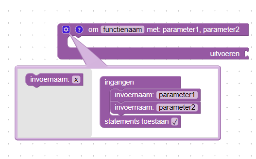
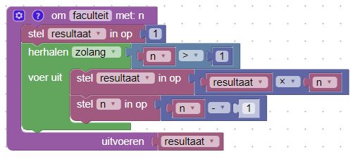
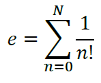

# Oefening 3: Terugkeer van Blokken

## Doel

Kennis maken met functies in de grafische programmeertaal Blokken.

## Opdracht

Maak een functie die de faculteit van een getal berekend. Gebruik deze functie om een benadering van het getal *e* te berekenen.

### Functies

Een functie is een aparte blok code met de bedoeling deze te hergebruiken in een programma of in een andere functie.

Figuur 1: Functie blok met een terugkeerwaarde en twee parameters.

Een functie heeft een naam en kan aangevuld worden met een parameterlijst. Deze parameters kunnen bij het aanroepen, i.e. het gebruik, van de functie ingesteld worden. Een parameter gedraagt zich als een variabele binnen het functie blok. In het uitvoeren stuk van de functie blok kan een terugkeerwaarde ingesteld worden. Dit is het resultaat van de functie na het aanroepen ervan.

1. Maak een functie om de faculteit van een getal te berekenen. Geef de functie de naam *faculteit*. Stel 1 parameter in en geef deze parameter de naam *n*. Het resultaat van *n!* wordt teruggeven in de terugkeerwaarde.
2. Per definitie is de faculteit van een positief geheel getal gelijk aan het product van alle gehele getallen kleiner dan of gelijk aan het positief geheel getal: *n! = 1 x 2 x 3 x  ... x n*, waarbij  *0! = 1*. Dit wil zeggen: als de parameter gelijk is aan de waarde 0 dient 1 teruggeven te worden.
3. In het ander geval wordt een lus voorzien waarbij de waarde van *n* telkens vermenigvuldigd wordt met *n-1* totdat de waarde 1 bereikt wordt. Dit resultaat wordt dan teruggegeven. Merk op: door gebruik te maken van een *resultaat* variabele en door de lus voorwaarde goed te kiezen, kan een **als** blok vermeden worden.

  

  Figuur 2: Voorbeeld van een functie om de faculteit van een getal te berekenen.

4. Probeer de faculteit functie eens uit door voor een paar bekende waarden de faculteit te bereken. Bvb. *0! = 1, 1! = 1, 5! = 120*.

#### Vraag 1

    Bereken 9! - 8! + 7! - 6! + 5! - 4! + 3! - 2! + 1! - 0! = ?

1. Maak een benadering van het de constante *e* aan de hand van onderstaande formule. Vraag aan de gebruiker om N op te geven. *Tip:* gebruik verschillende variabelennamen i.p.v. n en N.

#### Vraag 2

    Bij N = 10, vanaf het hoeveelste getal na de komma wijkt de berekende benadering van e af van de werkelijke waarde van e?

1. Maak een functie die voor een opgegeven getal:
  1. Indien het getal deelbaar is door 3: "Fizz" teruggeeft.
  2. Indien het getal deelbaar is door 5: "Buzz" teruggeeft.
  3. Indien het getal deelbaar is door 15: "FizzBuzz" teruggeeft.
  4. In alle andere gevallen het getal zelf teruggeeft.

  *Tip:* om te controleren of een getal deelbaar is door een ander getal, maak de restdeling en als het resultaat gelijk is aan 0 dan is het getal deelbaar. Of gebruik de **Test een getal** blok.
2. Test dit eens uit met een aantal getallen, bvb. 1, 0, -2, 3, 5, 6, 15, 30, -3.

#### Vraag 3

    Voor alle gehele getallen tussen [0, 10000], hoeveel worden door Fizz, Buzz of FizzBuzz vervangen?

### Extra

1. Maak een functie die voor een opgegeven jaartal bepaalt indien het een schrikkeljaar is (waar) of niet (onwaar). Een jaar is een schrikkeljaar indien:
  1. het deelbaar is door 4. bvb. 2008 is een schrikkeljaar.
  2. behalve als het deelbaar is door 100. bvb. 2100 is geen schrikkeljaar.
  3. met uitzondering van jaartallen deelbaar door 400. bvb. 2000 is een schrikkeljaar.
2. Maak een programma waarbij de gebruiker een jaartal kan ingeven en hoeveel schrikkeljaren weergegeven moeten worden na dit jaartal. Geef een lijst van het gewenste aantal schrikkeljaren weer.
3. Maak een programma die van twee gesorteerde lijsten een gecombineerde gesorteerde lijst maakt. bvb. [1,2,5] en [3,4,6] wordt [1,2,3,4,5,6].
