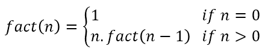
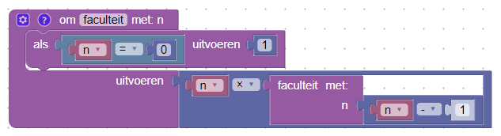
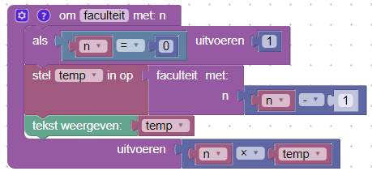
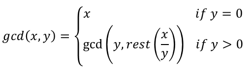
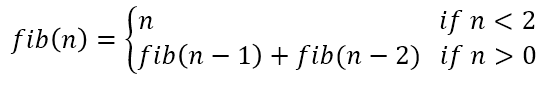

# Oefening 4: De laatste Blokken

## Doel

Toepassen van recursie in de grafische programmeertaal Blokken.

## Opdracht

Maak functies die recursief de faculteit van een getal, de grootste gemene deler van twee getallen en een bepaald getal uit de reeks van fibonacci berekenen.

### Recursie

In [oefening 3](chapter3.md) werd een functie gemaakt om de faculteit van een getal te berekenen. Deze functie kan echter ook op een recursieve manier geschreven worden. Wiskundig wordt de recursieve definitie van de faculteit van een getal beschreven als volgt:

Recursie betekent dat een functie zichzelf aanroept. Deze wiskundige definitie kan in een functie van Blokken gegoten worden.

Figuur 1: Recursieve functie om de faculteit van een getal te berekenen.

De functie faculteit wordt als volgt gedefinieerd: indien n gelijk is aan 0 dan geeft de functie **1** terug. In het andere geval geeft de functie **n . faculteit(n-1)** terug. Dit komt grotendeels overeen met de wiskundige recursieve definitie van faculteit, behalve dat in de recursieve faculteit functie de voorwaarde dat het getal n positief moet zijn niet gecontroleerd wordt.

1. Test deze functie eens uit met een aantal gekende waarden, bvb. *0! = 1, 1! = 1, 5! = 120*.

    #### Vraag 1

        Wat is het resultaat van de faculteit van een negatief getal met de recursieve faculteit functie?

2. Geef de tussenliggende resultaten van de recursieve functie weer.
  1. Maak een variabele waaraan de recursieve aanroep van faculteit(n-1) wordt toegekend in plaats van het **uitvoeren** deel van de faculteit functie.
  2. Plaats een **tekst weergegeven** blok met deze variabele binnen de functie.
  3. Vervang de recursieve aanroep in het uitvoeren deel door de variabele.

Figuur 2: Aangepaste recursieve functie om de tussenliggende resultaten weer te geven.

#### Vraag 2

    Wat zijn de tussenliggende resultaten voor 6!?

### Grootste Gemene Deler (GCD)

Het algoritme van Euclides berekent de grootste gemene deler van twee getallen en wordt als volgt gedefinieerd:

Indien de parameter y gelijk is aan 0 dan is x de grootste gemene deler en geef je dit resultaat terug. In het ander geval roep je opnieuw de functie aan waarbij de variabele y als eerste variabele wordt meegegeven en de rest van de gehele deling van x en y als tweede variabele.

1. Maak een functie om de grootste gemene deler te berekenen.
2. Test deze functie voor gcd(12, 9) = 3 en gcd(16, 24) = 8

#### Vraag 3

    gcd(5894,5866) = ?

### Fibonacci

De reeks van Fibonacci begint met 0 en 1 en alle daaropvolgende getallen worden berekend door de som van de twee voorgaande getallen.

1. Maak een recursieve functie die het n-de getal van Fibonacci kan berekenen.
2. Test dit uit met bvb. fib(0) = 0, fib(5) = 5

#### Vraag 4

    fib(20) = ?

### Extra

1. De reeks van Fibonacci kan ook niet-recursief berekend worden. Schrijf een programma dat een lijst weergeeft met de reeks van Fibonacci tot en met de 25ste waarde. Maak hiervoor geen gebruik van de recursieve functie.
2. Probeer eens de 25ste waarde van Fibonacci te berekenen met de recursieve functie. Vergelijk de tijd die de computer nodig heeft met de niet-recursieve functie. Hoe zou je dit verschil kunnen verklaren?
3. **Binair zoeken** is een efficiënt algoritme om in een *gesorteerde* lijst de positie van een bepaald getal te vinden.
Om een getal **x** te zoeken in een lijst van getallen beginnend met een **start** index en eindigend op een **einde** index:
  1. Kies een index in het **midden** van **start** en **einde**. *midden = start + (einde - start) / 2*
  2. Ofwel bevindt **x** zich op de positie van **midden**. Dan kan je **midden** teruggegeven en eindigt het algoritme.
  3. Ofwel is **x** kleiner dan het getal op de positie aangeduid door **midden**. Voer een nieuwe **binair zoeken** uit met **x** als nog steeds te zoeken waarde, **start** als start parameter en **midden-1** als nieuwe einde parameter.
  4. In het laatste geval is **x** groter dan het getal op de positie  aangeduid door midden. Voer dan een nieuwe **binair zoeken** uit met **x** als nog steeds te zoeken waarde, **midden+1** als nieuwe start parameter en **einde** als einde parameter.
